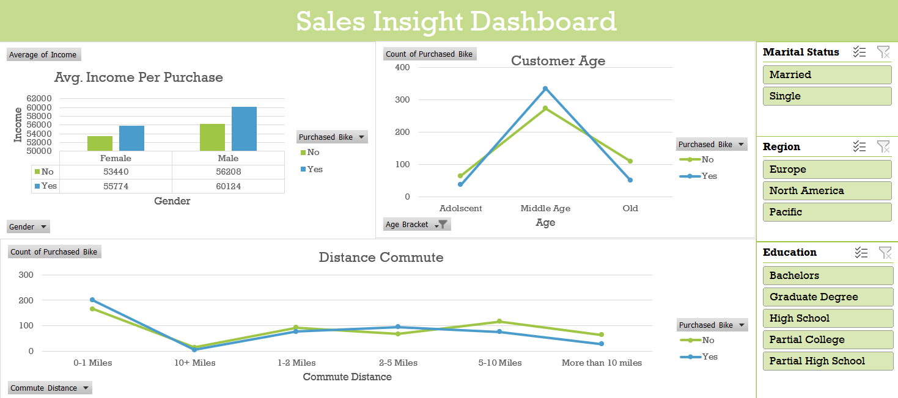

<h1 align="center">🚴‍♀️ Sales Insight Dashboard 📊</h1>

  

---

## 📌 Overview

This project showcases a dynamic and interactive **Excel Dashboard** built from raw bicycle sales data. The goal was to derive actionable insights that could help decision-makers understand purchasing trends based on demographic and behavioral data.

---

## 🔧 What I Did

- 📥 **Collected Raw Data** on bicycle purchases and customer demographics  
- 🧹 **Cleaned and Preprocessed** the dataset for consistency and accuracy  
- 🔄 **ETL Process**: Extracted, Transformed, and Loaded data into Excel  
- 📊 **Built Pivot Tables** to analyze key metrics (Age, Gender, Income, etc.)  
- 🎨 **Designed Charts & Slicers** to make the dashboard dynamic and user-friendly  

---

## 🎯 Key Visuals

  

- **Income per Purchase** by Gender
- **Customer Age Segmentation**
- **Commute Distance Analysis**
- **Dynamic Filters** for Marital Status, Region, and Education

---

## 🛠 Tools & Skills Used

| Tool | Purpose |
|------|---------|
| 🟢 Microsoft Excel | ETL, Pivot Tables, Dashboard |
| 🔷 Charts & Slicers | Dynamic visuals |
| 🟠 Data Cleaning | Manual and formula-based |
| 🧠 Analytical Thinking | Interpreting patterns and trends |

---

## 📈 Impact

> 🚴‍♀️ This dashboard provides a comprehensive snapshot of **who buys bicycles, when, and why**, helping businesses improve marketing and sales strategies.

---

## 🙋‍♀️ About Me

I’m **Riddhi Singh**, a passionate data analyst who loves transforming raw data into clear, visual stories that drive decisions.

🔗 [Connect with me on LinkedIn](https://www.linkedin.com/in/riddhi-singh0/)

---

## 📬 Contact

📧 singhriddhi128@gmail.com  
🌍 Montreal, Canada

---

⭐️ **If you like this project, give it a star!**  
📌 **Feel free to fork and contribute!**

